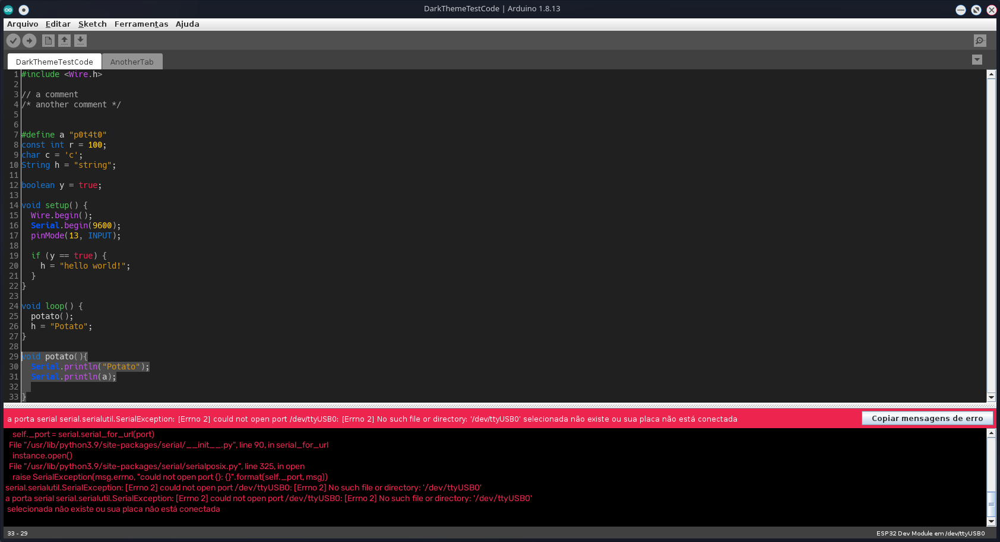
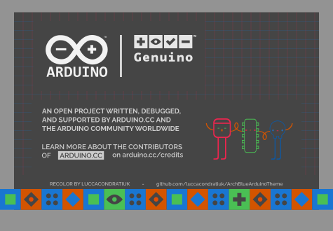

\- \- \-
 

# ArchDark Arduino Theme
Based on the work of [jeffThompson](https://github.com/jeffThompson/DarkArduinoTheme)

### Notes
* Tested in ArduinoIDE 1.8.13
* Tested in a Linux environment
    

### Fonts Dependencies
* [Hack](https://www.dafont.com/pt/hack.font)
* [Comfortaa](https://fonts.google.com/specimen/Comfortaa)
* [Raleway](https://fonts.google.com/specimen/Raleway)

\- \- \-

### INSTALLATION  
* Install the fonts listed above
* Mac users should look in `/Applications/Arduino.app/Contents/Java` and paste the `lib` folder inside (making a copy of the original in case want to revert back).  
* Windows is located in `C:\Program Files (x86)\Arduino`.  
* Linux will be in `/usr/share/arduino` – note you may need to install the Arduino IDE from the Arduino site, not a place like Ubuntu Software  

\- \- \-

Released under [Creative Commons BY-NC-SA license](http://creativecommons.org/licenses/by-nc-sa/3.0/) - feel free to use and modify and [let me know](https://github.com/luccacondratiuk).
Feel free to modify and PR
